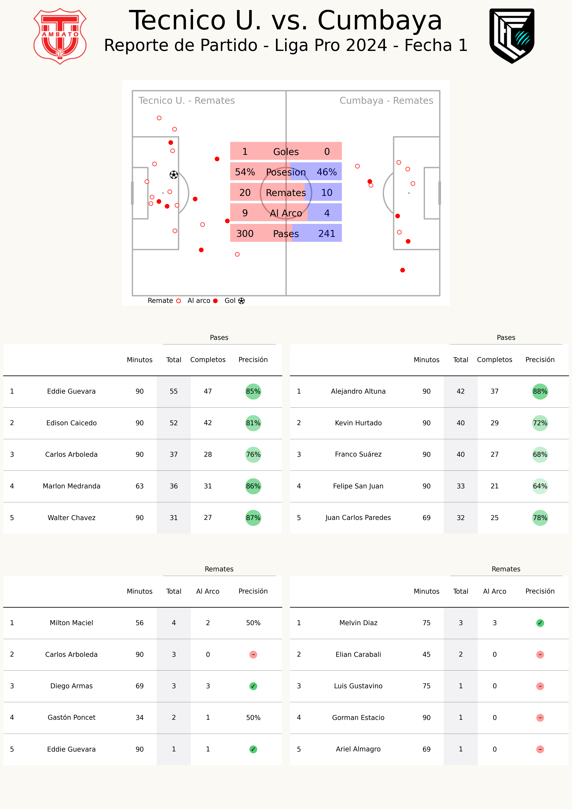
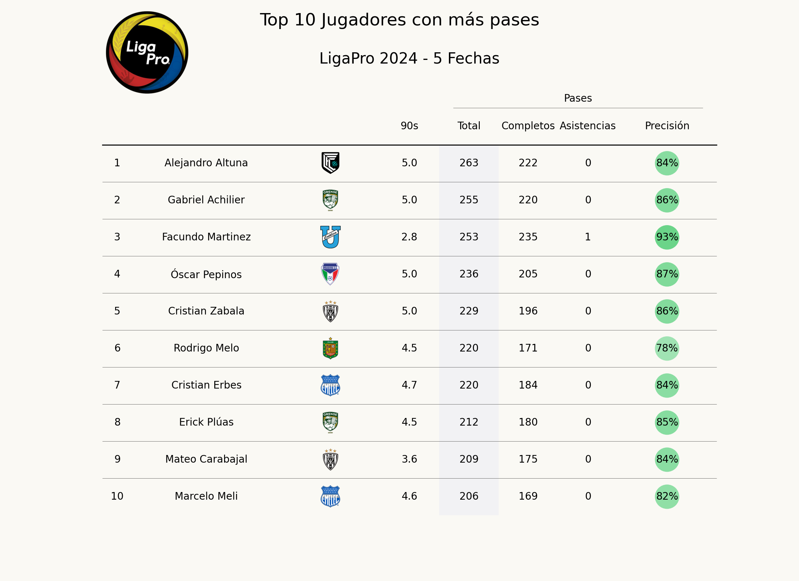
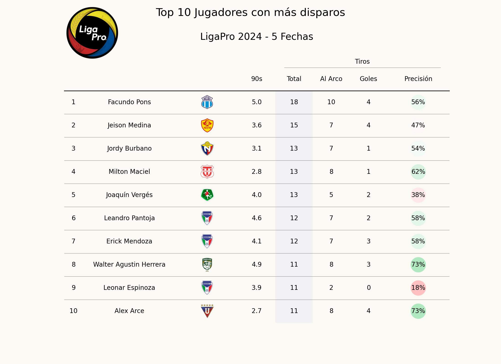

# Liga Pro Analytics

## How-to
SQLite database with scrapped statistics from Sofascore.

## Workflows
### 1. SQLite database
GUI to manually scrape sofascore match statistics
`pull_sofascore_data.py`

data saved to SQLite database at: `data\liga_pro_ecuador.db`

**Match report** with shotmap, stats and player shot+passes stats created with `match_report.py`.
Saved at `./images/match_report.png`.

### 2. Data to .csv (Legacy)
All at `./legacy`.

Abandoned because automation can get you IP banned.

#### **Process**:
Parse list of match IDs, scrape and save each match to single .json.

Scripts create .csv incorporating all .json files from `/matches`.

`create_tables.py` uses .csv to create `total_passes.png` and `total_shots.png`
## Reporte de Partido

 

### Top 10 jugadores con mas disparos

 

### Top 10 jugadores con mas pases completados

 
